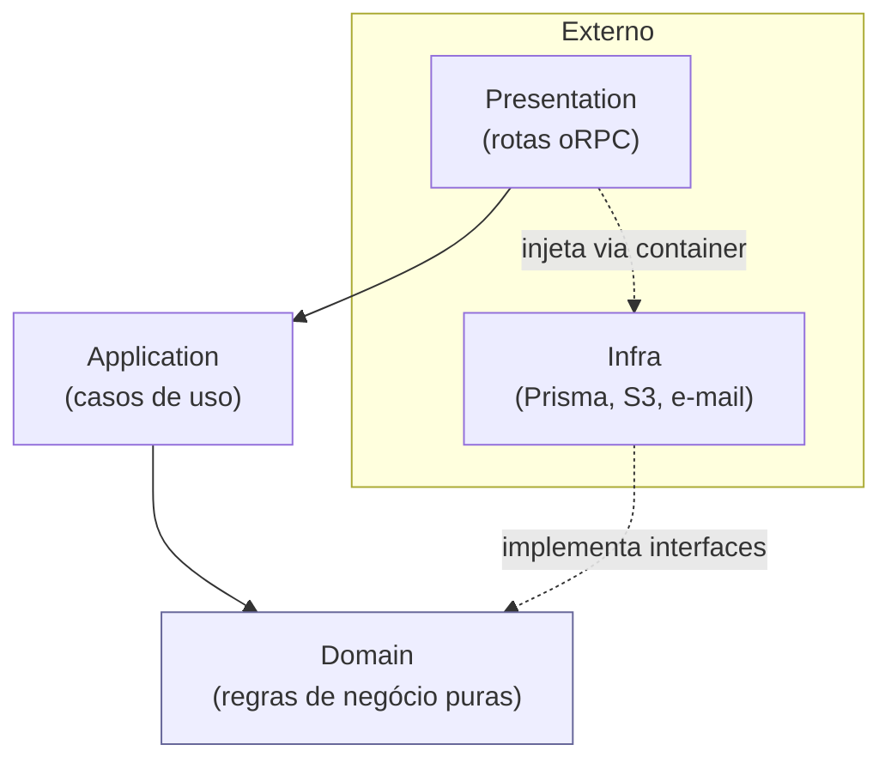
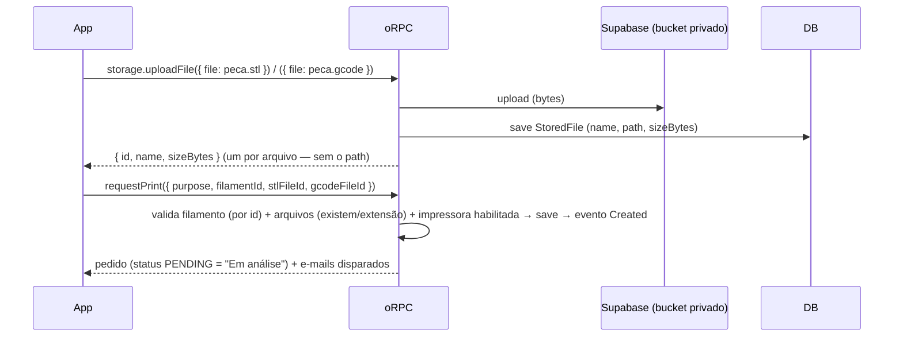
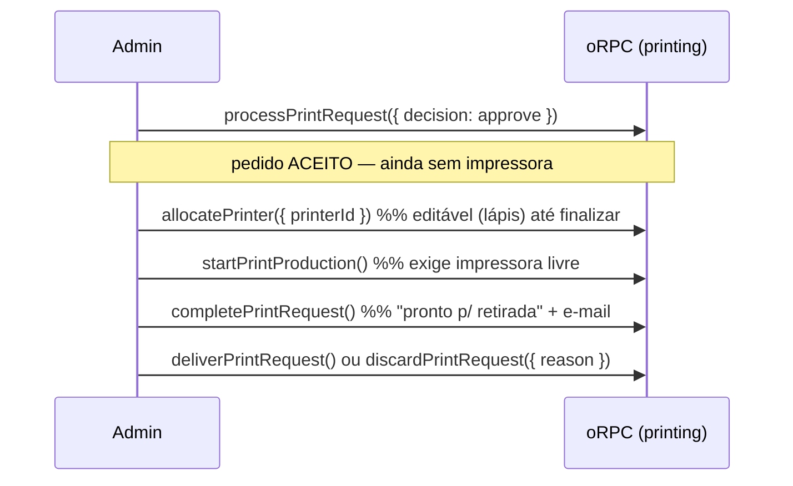

# Módulo `printing` — Documentação de Arquitetura

> Pedidos de impressão 3D do Locomotiva Hub. Substitui o fluxo antigo (e-mail manual) por um fluxo no app: o cliente envia o pedido com o **modelo 3D (`.stl`)** e o **arquivo fatiado (`.gcode`)**, escolhendo um **material do catálogo de filamentos** gerido pelo admin. O técnico analisa (aceita/recusa), vincula uma impressora quando decidir produzir, e conduz o pedido até a **entrega** (ou descarte). Não há agendamento por data — o técnico controla o momento de cada etapa.

Este módulo foi construído **espelhando o módulo `booking`** (referência do projeto) e segue rigorosamente a arquitetura **DDD + Clean Architecture modular** adotada no backend.

---

## 1. Princípios e regra de dependência

Cada módulo é dividido em 4 camadas com **dependência unidirecional** (de fora para dentro). Nada do domínio conhece framework; a infraestrutura implementa contratos definidos pelo domínio.



**Regras seguidas** (idênticas ao restante do backend):
- `domain/` não importa Prisma, oRPC, nem nada de framework. Define **interfaces** (repositórios, serviços) e as regras.
- `infra/` implementa essas interfaces (`PrismaXRepository`, `S3...`, `TemplateString...`).
- `application/` orquestra o domínio; converte primitivos ⇄ Value Objects; verifica permissão.
- `presentation/` apenas expõe os casos de uso como rotas; nenhuma regra de negócio aqui.
- A **injeção de dependência** (escolha das implementações concretas) acontece só no `_di_container`.

---

## 2. Estrutura de pastas

```
printing/
├── domain/                         # Regras de negócio (sem framework)
│   ├── entities/
│   │   ├── printer.ts              # Printer (Entity)
│   │   ├── filament.ts             # Filament (Entity) — catálogo de materiais
│   │   └── print-request.ts        # PrintRequest (AggregateRoot)
│   ├── value-objects/
│   │   └── print-purpose.ts        # PrintPurpose (valida tamanho 5–500)
│   ├── repositories/               # INTERFACES (contratos)
│   │   ├── printer.ts
│   │   ├── filament.ts
│   │   └── print-request.ts        # + read-model AdminItem
│   ├── services/
│   │   ├── print-request.ts        # PrintRequestService (criação + validação de arquivos + ocupação)
│   │   └── print-request-email-templater.ts   # interface (porta)
│   ├── events/                     # eventos de domínio (created/approved/started/completed/rejected/cancelled)
│   └── errors/                     # erros de domínio (DomainError)
│
├── application/                    # Casos de uso (orquestração)
│   ├── use-cases/                  # 22 casos de uso
│   ├── subscribers/
│   │   └── after-print-request-status-changed.ts   # reage a eventos → e-mail
│   └── errors/                     # erros de aplicação (ApplicationError)
│
├── infra/                          # Implementações concretas
│   ├── repositories/
│   │   ├── prisma-printer.ts
│   │   ├── prisma-filament.ts
│   │   └── prisma-print-request.ts
│   └── services/
│       └── template-string-print-request-email-templater.ts
│
└── presentation/
    └── orpc-routes/                # 22 rotas oRPC + index (printingRouter)
```

---

## 3. Camada Domain (o coração)

### 3.1 Entidades

| Entidade | Tipo base | Por quê | Responsabilidade |
|---|---|---|---|
| `Printer` | `Entity` | não emite eventos | máquina física (nome, modelo, ativa/inativa, observações). |
| `Filament` | `Entity` | não emite eventos | tipo de material do catálogo (nome único). O admin gere; o cliente escolhe. |
| `PrintRequest` | `AggregateRoot` | emite eventos de domínio | o pedido em si — guarda invariantes do ciclo de vida. |

**`PrintRequest`** é a peça central. Concentra as **regras de transição de estado** (invariantes), expostas como métodos de negócio — nenhuma camada externa altera o status diretamente:

```
PENDING ──approve()──────────────────▶ APPROVED          (aceite simples, sem impressora)
APPROVED ──allocatePrinter(id)───────▶ (vincula/troca a impressora; editável até finalizar)
APPROVED ──startProduction()─────────▶ IN_PRODUCTION     (exige impressora + regra de ocupação)
IN_PRODUCTION ──complete()───────────▶ COMPLETED         ("pronto para retirada"; libera a impressora)
COMPLETED ──deliver()────────────────▶ DELIVERED         (cliente retirou)
COMPLETED ──discard(reason)──────────▶ DISCARDED         (não retirado; motivo obrigatório)
PENDING ──reject(reason)─────────────▶ REJECTED
(PENDING|APPROVED) ──cancel(dono)────▶ CANCELLED         (cliente)
(PENDING|APPROVED|IN_PRODUCTION) ──adminCancel(reason)─▶ CANCELLED (técnico)
```

Visão do **cliente** (labels no app): `Em análise → Aguardando produção (approved e in_production) → Pronto para retirada → Entregue`, com `Recusado / Cancelado / Descartado` nos desvios.

- `cancel()` chama `checkOwner()` — só o dono cancela o próprio pedido (autorização **no domínio**).
- `allocatePrinter()` é bloqueado após `COMPLETED` (`PrintRequestPrinterLockedError`) — não faz sentido trocar a impressora de algo já impresso.
- `deliver()`/`discard()` exigem `COMPLETED` (`PrintRequestNotCompletedError`).
- O construtor valida o Value Object `PrintPurpose`; o estado inicial e o evento `PrintRequestCreatedEvent` são definidos no `static create()`.
- `toJSON()` devolve apenas primitivos (contrato Zod do namespace).

E-mail ao cliente em: criado, aprovado, **pronto para retirada** (completed), recusado e cancelado. As transições "em produção", "entregue" e "descartado" não disparam e-mail (decisão de produto).

### 3.2 Value Objects

| VO | Validação |
|---|---|
| `PrintPurpose` | 5–500 caracteres → `InvalidPrintPurposeError` |

> **Decisões registradas:**
> - O material é **dado dinâmico** (entity `Filament`, nome único validado no domínio — `InvalidFilamentNameError`, flag `active`). O pedido referencia o filamento **por id** (`filamentId`); por isso um filamento **já usado em pedidos não é excluído fisicamente** — a "exclusão" o **desativa** (`deactivate()`, soft-delete): some da escolha do cliente (`findAllActive`) e não pode ser usado em novos pedidos (`MaterialNotAvailableError`), mas o histórico continua resolvendo o nome. Filamento **nunca usado** é apagado de vez (`delete`).
> - Os arquivos do pedido são **entidades do módulo `storage`** (`StoredFile`) referenciadas por id (`stlFileId`/`gcodeFileId`). O antigo VO `PrintFile` foi removido; a validação de extensão (.stl / .gcode,.gco) vive no `PrintRequestService` (`InvalidPrintFileError`).
> - **Motivo obrigatório é regra de domínio**: `reject()`/`discard()`/`adminCancel()` validam o motivo (`PrintRequestReasonRequiredError`) — o schema Zod não carrega `.trim().min()`.

### 3.3 Repositórios (interfaces)

- `PrinterRepository`: `save`, `findAll`, `findAllEnabled`, `findById`, `delete`.
- `FilamentRepository`: `save`, `findAll` (todos, inclui desativados — uso admin/histórico), `findAllActive` (só ativos — escolha do cliente), `findById`, `findByName` (case-insensitive, p/ unicidade), `delete`.
- `PrintRequestRepository`: `save`, `findById`, `findByUserId` (paginado), `findAllAdmin` (paginado + filtros status/impressora/busca), `findInProductionByPrinter` e `findAllInProduction` (regra de ocupação / "em uso"), `existsActiveByPrinter` (guarda de exclusão de impressora), `existsByFilament` (guarda de exclusão de filamento). Inclui o **read-model** `AdminItem` (projeção com `user`/`printer` resolvidos) — mesmo padrão do `BookingRepository.AdminBookingItem`.

### 3.4 Domain Service

`PrintRequestService` concentra as regras que envolvem múltiplos agregados:
- `createPrintRequest()`: valida **impressora habilitada** (`NoPrinterAvailableError`), **filamento existente por id** (`MaterialNotAvailableError`), busca os dois arquivos no storage (`StoredFileService.getFile` → `FileNotFoundError`) e valida a **extensão de cada um** (`InvalidPrintFileError`); só então cria o agregado e persiste.
- `checkPrinterIsFree(printerId, ignoreId?)`: regra de ocupação (1 pedido EM PRODUÇÃO por impressora). No estilo do `checkIsAdmin`: **dispara `PrinterBusyError` em vez de retornar** — usada por `AllocatePrinter` e `StartPrintProduction` sem duplicar código.

### 3.5 Eventos de domínio

Implementam `IDomainEvent`, acumulados no agregado e **despachados pelo repositório no `save()`** (`DomainEvents.dispatchEventsForAggregate`) — efeitos colaterais só após a persistência.

---

## 4. Camada Application (casos de uso)

Cada caso de uso estende `UseCase<Input, Output>`, recebe `AuthUserService` (autorização) + dependências, **converte primitivos → Value Objects**, e devolve `.toJSON()`. Contratos (`InputSchema`/`OutputSchema`) são Zod, co-localizados no namespace.

### Casos de uso do cliente (`protectedRoute`)

| Caso de uso | Função |
|---|---|
| `RequestPrintUseCase` | cria o pedido por **referências**: `filamentId` + `stlFileId`/`gcodeFileId` (os arquivos já subiram pela rota `storage.uploadFile`) |
| `CancelPrintRequestUseCase` | cliente cancela o próprio pedido (autorização via `checkOwner`) |
| `FindMyPrintRequestsUseCase` / `GetPrintRequestByIdUseCase` | acompanhamento |
| `ListFilamentsUseCase` | catálogo de materiais (para o cliente escolher no app) |
| `ListPrintersUseCase` | impressoras (todas p/ admin, com flag `inUse`; habilitadas p/ cliente) |

### Casos de uso do técnico/admin (`protectedRoute` + `checkIsAdmin`)

| Caso de uso | Função |
|---|---|
| `ProcessPrintRequestUseCase` | **aceitar** (simples) ou **recusar** (motivo obrigatório) |
| `AllocatePrinterUseCase` | **vincular/trocar** a impressora de um pedido aceito (editável até finalizar; ocupação via `checkPrinterIsFree` se em produção) |
| `StartPrintProductionUseCase` | inicia a produção — a **entidade** exige impressora vinculada (`PrinterNotAllocatedError`) e o service, impressora livre |
| `CompletePrintRequestUseCase` | finaliza → **pronto para retirada** (dispara e-mail; libera a impressora) |
| `DeliverPrintRequestUseCase` | registra a **entrega** ao cliente |
| `DiscardPrintRequestUseCase` | registra o **descarte** (motivo obrigatório) |
| `AdminCancelPrintRequestUseCase` | cancelamento administrativo com motivo (até em produção) |
| `FindPrintRequestsAdminUseCase` | listagem paginada + filtros (status, impressora, busca) |
| `Create/Update/SetEnabled/Delete/GetPrinterByIdUseCase` | CRUD de impressoras |
| `Create/DeleteFilamentUseCase` | gestão do catálogo de filamentos (nome único; conflito → 409; **exclusão bloqueada se o filamento já foi usado em pedidos**) |

### Subscriber

`AfterPrintRequestStatusChanged` registra handlers nos eventos (`DomainEvents.register`) e dispara **e-mails** (cliente + técnico) de forma resiliente (cada handler em `try/catch`).

---

## 5. Camada Infra

- **`PrismaPrinterRepository` / `PrismaFilamentRepository` / `PrismaPrintRequestRepository`** implementam as interfaces do domínio. Cada um tem **mapper privado** `xDbToEntity` (Prisma → entidade) e nunca expõe o Prisma para fora. O `save()` de agregado faz `upsert` + `dispatchEventsForAggregate`.
  - O `findAllAdmin` faz o **enriquecimento** (join de `user`/`printer`) montando o read-model `AdminItem`.
- **`TemplateStringPrintRequestEmailTemplater`** implementa a interface de templating do domínio (HTML dos e-mails).

---

## 6. Camada Presentation (oRPC)

22 rotas no `printing` (+ 1 no `storage`), cada uma seguindo o template padrão do projeto: `protectedRoute`, `.input/.output` com os schemas do caso de uso, e handler envolto em `orpcSafe` chamando `container.getXUseCase(context.user)`. Contratos **tipados de ponta a ponta** — o frontend importa o tipo do router e usa `orpc.printing.*` / `orpc.storage.*` sem codegen.

| Recurso | Método + caminho |
|---|---|
| Upload (módulo storage) | `POST /storage/files` (multipart — o arquivo vai no corpo) |
| Pedidos (cliente) | `POST /printing/print-requests`, `POST .../{id}/cancel`, `POST .../mine/search`, `GET .../{id}` |
| Pedidos (admin) | `POST .../search`, `POST .../{id}/process`, `POST .../{id}/allocate-printer`, `POST .../{id}/start-production`, `POST .../{id}/complete`, `POST .../{id}/deliver`, `POST .../{id}/discard`, `POST .../{id}/admin-cancel` |
| Impressoras | `GET/POST /printing/printers`, `GET/PUT/DELETE /printing/printers/{id}`, `PUT .../{id}/enabled` |
| Filamentos | `GET/POST /printing/filaments`, `DELETE /printing/filaments/{id}` |

---

## 7. Módulo `storage` (arquivo como entidade de domínio)

Arquivo é um conceito **transversal** — não pertence ao `printing`. O `storage` agora tem **domínio próprio**, com o arquivo como entidade de primeira classe:

```
storage/
├── domain/
│   ├── entities/stored-file.ts        # StoredFile — name, path (chave no bucket), sizeBytes, deleted
│   ├── repositories/stored-file.ts    # INTERFACE: StoredFileRepository (save, findById)
│   ├── services/
│   │   ├── file-storage-service.ts    # PORTA: uploadFile(blob) + createDownloadUrl(storedFile)
│   │   └── stored-file.ts             # StoredFileService: uploadFile (bucket + registro) e getFile (ou erro)
│   └── errors/                        # InvalidFileNameError, FileNotFoundError, FileDeletedError
├── application/use-cases/upload-file.ts   # UploadFileUseCase (input multipart: { file, fileName })
├── infra/
│   ├── repositories/prisma-stored-file.ts # + mapper exportado (reusado pelo printing)
│   └── services/supabase-file-storage-service.ts   # ADAPTER: Supabase Storage
└── presentation/orpc-routes/          # storageRouter: uploadFile
```

**Fluxo de upload**: o front envia o arquivo **pra API** (`orpc.storage.uploadFile`, multipart); a API sobe pro bucket privado (`upload`) e **registra a entidade `StoredFile`** no banco. O `toJSON()` da entidade devolve **só o que pode ir pro usuário** (`id`, `name`, `sizeBytes`, `deleted`) — o `path` (chave do bucket) nunca circula fora do backend. O download continua por **URL assinada** (`createDownloadUrl(storedFile)`), restrito a admin/dono.

**Exclusão lógica**: o campo `deleted` marca arquivos removidos do bucket sem apagar o registro do sistema — o admin vê o nome do arquivo em cinza, sem download (o fluxo que efetivamente remove do bucket fica pra fase 2).

O container exige `SUPABASE_URL` + `SUPABASE_SECRET_KEY` + `STORAGE_BUCKET` (sem elas, lança erro explícito). A porta `BucketStorageService` isola o provedor — trocar de storage é implementar outro adapter, sem tocar no `printing`.

---

## 8. Injeção de dependência

Tudo montado no `_di_container/container.ts`, na ordem **repositório → serviço → caso de uso → subscriber**:
- Repositórios e serviços: *singletons lazy*.
- `BucketStorageService`: `SupabaseBucketStorageService` (erro explícito se as credenciais faltarem).
- Casos de uso: nova instância por requisição, recebendo o usuário autenticado.
- Subscriber instanciado uma vez no boot.

---

## 9. Modelo de dados (Prisma)

```
printers        (id, name, model, enabled, notes?, timestamps)
filaments       (id, name UNIQUE, timestamps)
files           (id, name, path, sizeBytes?, deleted, timestamps)      ← módulo storage
print_requests  (id, userId, printerId?, purpose,
                 stlFileId, gcodeFileId, filamentId,
                 status, rejectionCancelReason?, timestamps)
```

O pedido guarda **referências por id** (arquivos e filamento); a hidratação (nomes dos arquivos, nome do material) acontece no repositório, em lote por página. Cada mudança foi entregue como **migração versionada** (a mais recente, `storage_files_and_print_request_by_id`, cria `files` e troca os snapshots por ids).

---

## 10. Fluxos principais

**Criar pedido (cliente) — upload via API, arquivo registrado como entidade:**



**Ciclo do técnico (admin):**



---

## 11. Decisões arquiteturais e justificativas

| Decisão | Justificativa |
|---|---|
| **Módulo novo `printing`** (não estender `booking`) | domínio próprio (arquivos, material, análise técnica, produção física). |
| **Módulo `storage` separado** | upload é transversal; port/adapter reusável. |
| **Sem agendamento por data** | escolha de produto: o técnico decide *quando* iniciar cada produção; datas geravam burocracia sem valor. O controle temporal é implícito no ciclo de status. |
| **Catálogo de filamentos dinâmico, referenciado por id** | o admin cadastra os materiais (entity `Filament`, nome único); o app monta as opções dinamicamente. O pedido referencia o filamento **por id** — em troca, um filamento usado em pedidos não é excluído fisicamente: a exclusão o **desativa** (flag `active`), preservando o histórico e removendo-o das novas escolhas. |
| **Dois arquivos por pedido (.stl + .gcode)** | o `.stl` documenta o modelo; o `.gcode` é o que a impressora executa. Validação de extensão em **duas camadas**: no app (filtro do file picker + checagem) e no `PrintRequestService` (na criação do pedido). |
| **Arquivo como entidade (`StoredFile`) com exclusão lógica** | o registro do arquivo sobrevive à remoção do bucket (`deleted`); o `path` do bucket nunca vai pro cliente (toJSON restrito); o histórico do pedido fica rastreável. |
| **Aceite ≠ alocação** | aceitar é análise; vincular impressora é logística. Separar os dois permite aceitar rápido e alocar quando for produzir (impressora editável — até finalizar). |
| **Ocupação 1-por-impressora** | uma impressora imprime um job por vez; `startProduction` (e a troca de impressora durante a produção) bloqueiam se a máquina já tem pedido EM PRODUÇÃO. |
| **Estados pós-produção (`delivered`/`discarded`)** | fecham o ciclo físico da peça (retirada ou descarte com motivo) — rastreabilidade completa do pedido. |
| **Read-model `AdminItem`** | a listagem administrativa precisa de `user`/`printer`; projeção dedicada evita N+1 e mantém a entidade limpa. |
| **Upload via API (não mais presigned de escrita)** | o arquivo passa pelo backend, que valida a sessão, sobe pro bucket e registra a entidade numa única transação lógica — o cliente nunca vê chave/URL do bucket; o download continua assinado (leitura temporária). |

---

## 12. Aderência aos padrões do projeto (checklist)

- [x] 4 camadas com dependência unidirecional; Prisma confinado em `infra/`.
- [x] Entidades com `static create`, métodos de negócio que validam invariantes, `toJSON()` e namespace Zod.
- [x] `AggregateRoot` (com eventos) vs `Entity` simples aplicado corretamente.
- [x] Value Objects auto-validados com erros de domínio.
- [x] Repositórios como **interface** no domínio + implementação Prisma na infra, com mapper privado.
- [x] Casos de uso `extends UseCase`, autorização via `AuthUserService`, conversão primitivo↔VO, `.toJSON()` no retorno.
- [x] Eventos de domínio despachados no `save()`; subscriber reativo para e-mails.
- [x] Rotas oRPC padronizadas (`orpcSafe` + container), tipadas de ponta a ponta.
- [x] DI no container na ordem repo → serviço → use case → subscriber.
- [x] Erros tipados (`DomainError`/`ApplicationError`) — nunca `throw new Error` cru.

---

## 13. Verificação

- **Type-check** do backend, do admin e do mobile sem erros; build de produção do admin (`vite build`).
- **Migrações** aplicadas e Prisma client gerado.
- **Fluxo validado de ponta a ponta** (contra o Supabase real) durante o desenvolvimento: catálogo de filamentos (criação + bloqueio de duplicado), **upload real dos dois arquivos** + **download assinado**, material fora do catálogo bloqueado, criação do pedido, listagens, e o ciclo completo com os bloqueios de invariante (produção sem aceite/sem impressora, troca de impressora após finalizar), ocupação da impressora, **entrega**, **descarte** e **recusa**.

---

## 14. Frontends

**Admin** (`apps/admin`, área "IMPRESSÃO 3D" — MUI + React Query, tipos direto do backend via oRPC):
- **Gerenciar Impressoras** — CRUD de impressoras + seção **Tipos de Filamento** (catálogo que alimenta o app do cliente).
- **Pedidos** — tabela (solicitante, material, arquivos, impressora, status) + filtros + paginação. O motivo aparece só no detalhe.
- **Modal de detalhe** (`PrintRequestDetailDialog.tsx`) — segue a máquina de estados: *Em análise* → Recusar (motivo) / Aceitar; *Aprovado* → bloco "Impressora vinculada" com **lápis** (vincular/trocar) + Iniciar produção (bloqueado sem impressora) + Cancelar (motivo); *Em produção* → Finalizado + Cancelar; *Pronto p/ retirada* → **Entregue** / **Descartado** (motivo). Fecha só pelo X.

**Mobile** (`apps/mobile`, cliente):
- Item **"Impressões 3D"** no menu lateral (hambúrguer ao lado de "Locomotiva").
- **Novo pedido em 2 passos**: (1) anexar `.stl` + `.gcode` (file picker filtrado por extensão + validação), material dinâmico do catálogo, motivo (5–500); (2) revisão e confirmação.
- **Acompanhamento** com os status do cliente: Em análise / Aguardando produção / Pronto para retirada / Entregue (+ Recusado/Cancelado/Descartado com motivo). Cancelamento permitido até o aceite (pending/approved).

> Pendente (fase futura): download seguro dos arquivos (presigned GET) no admin, storage real (S3/Supabase) em produção e deploy do backend.
